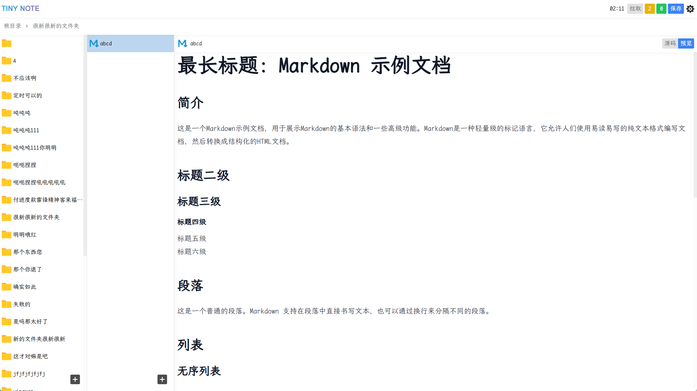

<div align="center">
    
</div>

# Tiny Note

很简单的笔记应用.

> 欢迎提出 issue 和 PR.

<p align="center">
    
    
    <a href="https://hub.docker.com/r/keenghost/tinynote"></a>
    <br>
    
    
    
</p>

## 部署

- ### Docker部署

  ```
  docker run -d --restart=always -v /主机目录/runtime:/tinynote/runtime -p 7777:7777 -e WEB_USER=用户名 -e WEB_PASS=密码 -e WEB_PORT=7777 -e TOKEN_SECRET=自定义密钥 -e WEB_DB_PASS=自定义客户端数据库密码 keenghost/tinynote:latest
  ```

- ### 源代码部署

  > 确保已安装 node 环境, 同时已安装 pnpm.

  ```
  git clone https://github.com/keenghost/TinyNote.git TinyNote
  cd TinyNote && pnpm i && pnpm build srv web
  cd packages/srv/dist && pnpm start
  ```

  这会启动 TinyNote 服务并监听 7777 端口, 访问 http://127.0.0.1:7777 即可访问 web 端 ui.
  环境变量:

  - WEB_USER: 自定义的用户名
  - WEB_PASS: 自定义的密码
  - WEB_PORT: 指定 Web 端 UI 监听的端口, 默认 7777
  - TOKEN_SECRET: 自定义的 Token 加密密钥, 默认随机生成
  - WEB_DB_PASS: 自定义的客户端数据库密码, 默认随机生成

  > 配置文件位于 packages/srv/dist/runtime/config.json

## 调试

```
git clone https://github.com/keenghost/TinyNote.git TinyNote
cd TinyNote && pnpm i && pnpm dev srv web
```

访问 http://127.0.0.1:7777 即可访问 web 端 ui.

## 预览

<div align="center"></div>
